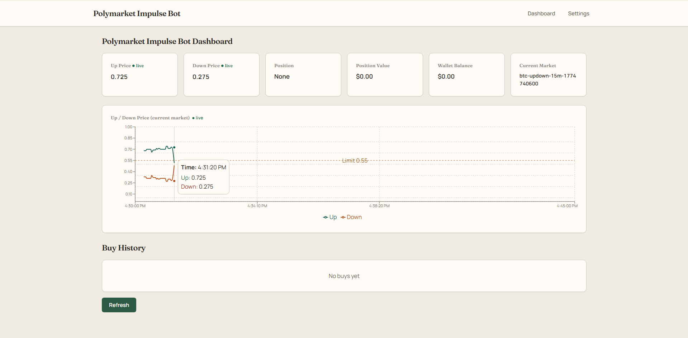
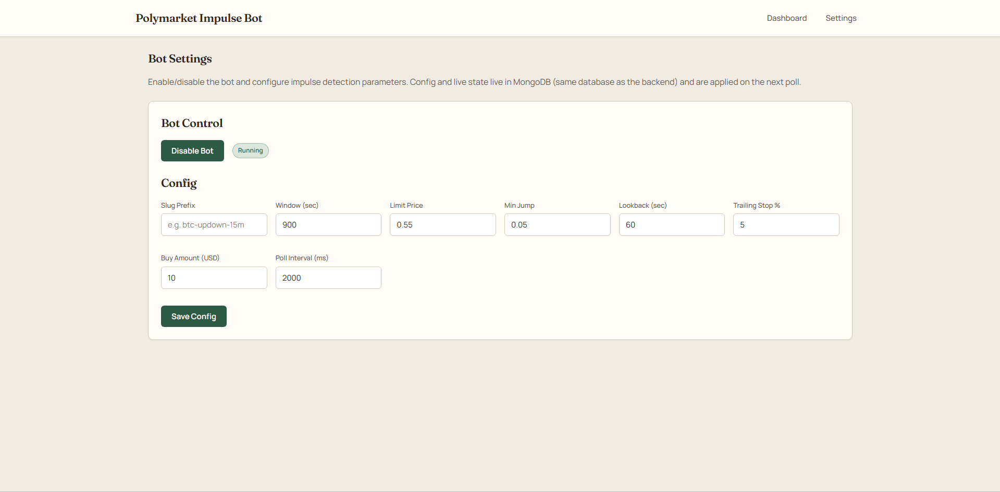

# Polymarket Impulse Monitoring Bot

> **Automated momentum trading for Polymarket Up/Down markets** — detect sharp price moves, enter on the rising side, manage risk with a trailing stop, hedge when conditions flip, and redeem settled positions — all backed by a real-time dashboard.

[](https://nodejs.org/)
[](https://www.typescriptlang.org/)
[](https://www.mongodb.com/)

---

## Table of contents

- [Overview](#overview)
- [How the strategy works](#how-the-strategy-works)
- [Stack & architecture](#stack--architecture)
- [Multi-market & extensibility](#multi-market--extensibility)
- [For developers](#for-developers-reusing-the-logic)
- [Installation](#installation)
- [Usage](#usage)
- [Configuration](#configuration)
- [Environment variables](#environment-variables)
- [Disclaimer](#disclaimer)

---

## 📌 Overview

The **Polymarket Impulse Monitoring Bot** is a TypeScript service plus a **Next.js** control panel. It watches short-lived **Up/Down** binary markets (e.g. crypto 5m/15m windows), streams prices from the **Polymarket CLOB**, persists state in **MongoDB**, and executes trades through your **proxy wallet** when impulse rules fire.

| Capability | Description |
|------------|-------------|
| 📈 **Impulse detection** | Configurable jump + limit-price rules over a rolling lookback window |
| 🛡️ **Risk** | Trailing stop triggers an opposite-side hedge |
| 💰 **Settlement** | Optional auto-redeem when markets resolve |
| 🖥️ **Dashboard** | Live prices, chart, position, wallet context, buy history |
| ⚙️ **Settings UI** | Enable/disable bot and edit parameters (stored in MongoDB) |

---

## 🎯 How the strategy works

The bot implements a **momentum-style impulse** workflow:

1. **Market selection** — Tracks Up/Down markets matching a configurable **slug prefix** (e.g. `btc-updown-5m`) inside a fixed **time window** (e.g. 300s or 900s).
2. **Impulse detection** — If either side’s price **jumps** by at least `minJump` from the minimum in the lookback window **and** the price is above `limitPrice`, the move qualifies as an impulse.
3. **Initial buy** — On impulse, the bot buys **once** on the rising side (FAK at best ask). It does **not** buy both sides on the same impulse.
4. **Trailing stop** — After entry, it tracks the **highest** price since buy. If price falls by `trailingStopPct` from that high, the stop triggers.
5. **Hedge** — On stop, it buys the **opposite** side so exposure is conceptually flattened ahead of resolution (Up + Down → $1 at settlement in the binary framing).
6. **Auto-redeem** — When the market resolves, winning positions can be redeemed automatically (when enabled).
7. **Real-time prices** — Backend uses the **CLOB WebSocket**; the dashboard reflects live Up/Down prices on the chart.

---

## 🏗️ Stack & architecture

| Layer | Technology |
|-------|------------|
| Runtime | Node.js 18+, TypeScript |
| Trading / data | `@polymarket/clob-client`, WebSocket mid/book updates |
| Persistence | MongoDB (`impulse_bot_meta`, `impulse_bot_prices`, `impulse_bot_positions`, `impulse_buys`, …) |
| API & loop | Express + polling impulse monitor (`src/`) |
| Dashboard | Next.js 14 (`frontend/`, default dev port **3004**) |

**Shared database** — The frontend API routes use the **same** `MONGODB_URI` / `MONGODB_DB` as the bot so the UI and backend always see one source of truth (no Redis).

---

## 🌍 Multi-market & extensibility

The bot is driven by a **slug prefix** and **window length**. Examples:

| Slug prefix | Window (sec) | Example |
|-------------|----------------|---------|
| `btc-updown-5m` | 300 | Bitcoin 5-minute |
| `btc-updown-15m` | 900 | Bitcoin 15-minute |
| `eth-updown-5m` | 300 | Ethereum 5-minute |

1. Set `POLYMARKET_SLUG_PREFIX` and `IMPULSE_WINDOW_SECONDS` in `.env`, **or**
2. Use **Settings** in the UI (persisted in MongoDB; applied on the next backend poll).

The bot rolls forward to the **next** market when the current window ends.

### Generic impulse logic

The same **state machine** can be adapted to other domains that expose two-sided prices and executable orders: sports, politics, climate/event markets, or other binary instruments — swap the **price feed**, **executor**, and **settlement** adapters while keeping the config knobs (`limitPrice`, `minJump`, `lookbackSec`, `trailingStopPct`, `buyAmountUsd`).

---

## 👩‍💻 For developers (reusing the logic)

To port the idea into your own system:

1. Implement a **price feed** for two outcomes (bid/ask or mid).
2. Implement an **order executor** for entry and hedge orders.
3. Track **position state** (side, `highestPrice`, hedge rules).
4. Preserve the same **configuration surface** for comparable behavior.
5. Plug in a **market selector** that defines the active window and rollover (slug + duration is one pattern).

---

## 🚀 Installation

### Prerequisites

- **Node.js** 18 or newer  
- **MongoDB** (local or Atlas)  
- A **Polymarket** account with **proxy wallet** + API credentials workflow as documented below  

### Steps

1. **Clone** the repository.

2. **Install dependencies**

   ```bash
   npm install
   cd frontend && npm install && cd ..
   ```

3. **Environment** — copy the example file and edit:

   ```bash
   cp .env.example .env
   ```

   **Required highlights**

   | Variable | Role |
   |----------|------|
   | `POLYMARKET_SLUG_PREFIX` | Market family (e.g. `btc-updown-5m`) |
   | `IMPULSE_WINDOW_SECONDS` | Window in seconds (300 / 900 / …) |
   | `PRIVATE_KEY` | EOA key used to sign (keep secret) |
   | `PROXY_WALLET_ADDRESS` | Polymarket proxy / Safe address |
   | `MONGODB_URI` | Mongo connection string |
   | `MONGODB_DB` | Database name (default `polymarket_impulse`) |

   **Frontend** — create `frontend/.env` or `frontend/.env.local` with the **same** `MONGODB_URI` and `MONGODB_DB` so the dashboard APIs read/write shared state.

4. **Polymarket API credential** (one-time; after `npm run build` or use `ts-node` against source):

   ```bash
   npm run build
   npx ts-node -e "
   require('dotenv/config');
   const { createCredential } = require('./dist/security/createCredential');
   createCredential();
   "
   ```

5. **Build**

   ```bash
   npm run build
   cd frontend && npm run build && cd ..
   ```

---

## ▶️ Usage

### Development

**Backend**

```bash
npm run dev
```

**Frontend**

```bash
cd frontend && npm run dev
```

Open **http://localhost:3004** for the dashboard and settings.

### Production (PM2)

```bash
npm run build
cd frontend && npm run build
pm2 start ecosystem.config.cjs
```

Typical processes:

- `impulse-bot` — trading loop + API  
- `impulse-frontend` — Next.js on port **3004**

---

## ⚙️ Configuration

Parameters can be set in **`.env`** (defaults / bootstrap) and overridden from the **Settings** page (**MongoDB**). The backend refreshes config on its poll cycle.

### Dashboard



- Live **Up / Down** prices (WebSocket when connected)  
- **Position**, **position value**, **wallet balance**, **current market** slug / condition  
- **Chart** — window prices, limit reference, impulse markers  

### Settings



| Parameter | Default (env) | Description |
|-----------|----------------|-------------|
| **Slug prefix** | from `POLYMARKET_SLUG_PREFIX` | Prefix; full slug adds timestamp segment |
| **Window (sec)** | `IMPULSE_WINDOW_SECONDS` | e.g. 300 (5m), 900 (15m) |
| **Limit price** | `0.55` | Minimum price to arm an impulse |
| **Min jump** | `0.05` | Minimum rise vs lookback min |
| **Lookback (sec)** | `60` | Rolling window for jump detection |
| **Trailing stop %** | `5` | Drawdown from high → hedge |
| **Buy amount (USD)** | `10` | Notional for entry / hedge orders |
| **Poll interval (ms)** | `2000` | Backend poll cadence |

**Bot control** — Enable / disable is stored in MongoDB and honored on the next poll.

---

## 📋 Environment variables

| Variable | Default | Description |
|----------|---------|-------------|
| `POLYMARKET_SLUG_PREFIX` | — | Market prefix (e.g. `btc-updown-15m`) |
| `IMPULSE_WINDOW_SECONDS` | `900` | Market window (seconds) |
| `IMPULSE_LIMIT_PRICE` | `0.55` | Min price for impulse |
| `IMPULSE_MIN_JUMP` | `0.05` | Min jump vs lookback min |
| `IMPULSE_LOOKBACK_SEC` | `60` | Lookback window (seconds) |
| `IMPULSE_TRAILING_STOP_PCT` | `5` | Trailing stop (percent) |
| `IMPULSE_BUY_AMOUNT_USD` | `10` | Order size (USD) |
| `IMPULSE_POLL_INTERVAL_MS` | `2000` | Poll interval (ms) |
| `ENABLE_IMPULSE_BOT` | `true` | Master enable (unless `"false"`) |
| `ENABLE_AUTO_REDEEM` | `true` | Auto-redeem resolved positions |
| `PRIVATE_KEY` | — | Ethereum private key |
| `PROXY_WALLET_ADDRESS` | — | Polymarket proxy address |
| `CLOB_API_URL` | `https://clob.polymarket.com` | CLOB base URL |
| `CHAIN_ID` | `137` | Polygon mainnet |
| `MONGODB_URI` | — | MongoDB URI |
| `MONGODB_DB` | `polymarket_impulse` | Database name |
| `API_PORT` | `3003` | Backend HTTP port |

---

*Built with TypeScript, MongoDB, and Next.js — happy shipping.* 🚀
